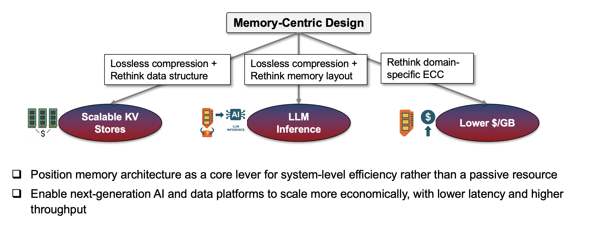

**Welcome!** I am a PhD candidate in the ECSE Department at Rensselaer Polytechnic Institute, advised by [Tong Zhang](https://sites.ecse.rpi.edu/~tzhang/).
I earned my BE in Southern University of Science and Technology.

My research focuses on optimizing memory architectures, primarily DRAM and SSDs, to enhance hardware performance and software efficiency. I explore solutions in data processing and AI, aiming to contribute to more efficient and sustainable computing systems.

Feel free to reach out. I am always happy to chat!
📧 Email: xier2 [at] rpi (dot) edu

## 🏫 Education
**PhD Candidate in Computer & Systems Engineering** — *Rensselaer Polytechnic Institute*  
   📍 Troy, NY, USA | 🗓️ 2022 – Present

**BE in Microelectronics Science and Engineering** — *Southern University of Science and Technology*  
   📍 Shenzhen, China | 🗓️ 2018 – 2022

## 💼Experience
**Platform & ASIC Research Intern** — *Nokia Bell Labs*  
   📍 Murray Hill, NJ, USA | 🗓️ 2025  

**EDA Engineer Intern** — *BTD Technology*  
   📍 Shenzhen, China | 🗓️ 2021 – 2022  

**Research Intern** — *University of Hong Kong*  
   📍 Hong Kong SAR, China | 🗓️ 2020

**Visiting Student** — *University of Oxford*  
   📍 Oxford, UK | 🗓️ 2019

<!-- ## 📰News

* **06/2023** Our work accepcted by in ISMM 2023.
* **11/2021** An oral report at IEEE ICTA 2021 (Zhuhai) (Online).
* **09/2021** A work was accepted by [IEEE ICTA 2021](http://www.ieee-icta.net/) -->

## 📕Publications

1. **Rui Xie**, Asad Ul Haq, Yunhua Fang, Linsen Ma, Sanchari Sen, Swagath Venkataramani, Liu Liu, Tong Zhang, "Breaking the HBM Bit Cost Barrier: Domain-Specific ECC for AI Inference Infrastructure", arXiv preprint arXiv:2507.02654 ([paper](https://arxiv.org/abs/2507.02654))
   
2. **Rui Xie**, Asad Ul Haq, Linsen Ma, Yunhua Fang, Zirak Burzin Engineer, Liu Liu, Tong Zhang, "Reimagining Memory Access for LLM Inference: Compression-Aware Memory Controller Design", arXiv preprint ([paper](https://arxiv.org/abs/2503.18869))

3. **Rui Xie**, Linsen Ma, Alex Zhong, Feng Chen, Tong Zhang, "ZipCache: A Hybrid-DRAM/SSD Cache with Built-in Transparent Compression", 10th International Symposium on Memory Systems ([paper](doc/ZipCache_v1-2.pdf)) ([slides](doc/2024-10-01-zipcache.pdf))

4. **Rui Xie**, Asad Ul Haq, Linsen Ma, Krystal Sun, Sanchari Sen, Swagath Venkataramani, Liu Liu, Tong Zhang, "SmartQuant: CXL-based AI Model Store in Support of Runtime Configurable Weight Quantization", arXiv preprint ([paper](https://arxiv.org/abs/2407.15866))

5. Linsen Ma, **Rui Xie**, Tong Zhang, "ZipKV: In-Memory Key-Value Store with Built-In Data Compression", 2023 International Symposium on Memory Management ([paper](https://dl.acm.org/doi/abs/10.1145/3591195.3595273))

[(More)](publications.md)

<!-- ## 📕 Publications

[(More)](publications.md) -->

## 🏆 Honors and Awards

1. **Outstanding Innovation Award 2nd Place Winner**, Nokia Bell Labs - *2025*
   
2. **DAC Young Fellow Award**, 61th Design Automation Conference - *2024*
   
3. **Excellent Graduate Award**, Southern University of Science and Technology — *2022*
   
4. **First Class Student Scholarship** *(Top 5%)*, Southern University of Science and Technology — *2021*
   
5. **First Prize of College Student Innovation and Entrepreneurship Training Program**, Southern University of Science and Technology - *2021*

## 📒 Peer Reviewer Experience
1. **IEEE International Symposium on Circuits and Systems** - 2022, 2023, 2024

<!-- * Excellent Graduate in Southern University of Science and Technology, Jun. 2022
* Graduation with Honor: College Graduate Excellence Award, Jun. 2022
* First Class of the Merit Student Scholarship, Sep. 2021
* First Prize of College Student Innovation and Entrepreneurship Training Program, Mar. 2021 -->

<!-- (Last Updated Jan. 2024) -->

<!-- 
You are the No.  vistor of my homepage.
 -->

<!-- --- -->

<!-- for rickxie.cn -->

<!-- <a class="twitter-timeline" data-width="800" data-height="600" data-theme="light" href="https://twitter.com/RickXie10?ref_src=twsrc%5Etfw">Tweets by RickXie10</a>  -->
